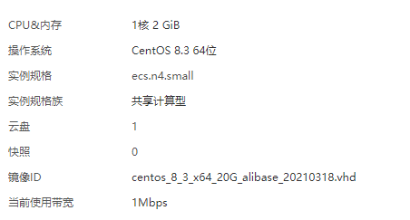
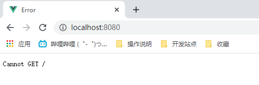
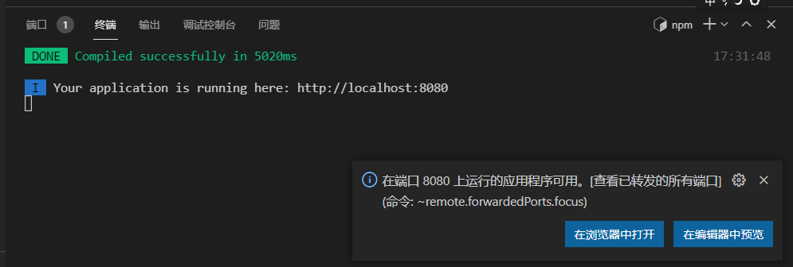
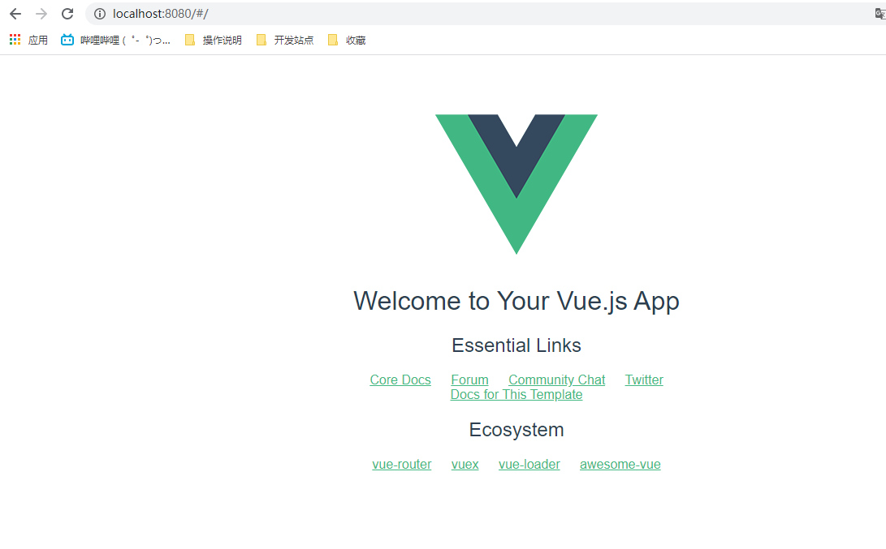

# 一、准备

## 1. 服务器
我这里的选择是阿里云的`ecs.n4.small`。


## 2. 安装环境
**思路：**
1. 通过nvm对node版本控制
2. 使用vue-cli2
```shell
# 安装git
yum install git -y

# 安装nvm
wget -qO- https://raw.githubusercontent.com/creationix/nvm/v0.31.1/install.sh | bash

# 使环境变量生效
source ~/.bashrc

# 安装并使用指定node版本
nvm install v8.9.4

# 使用cnpm
npm i -g cnpm --registry=https://registry.npm.taobao.org

# 安装vue-cli@2.X
cnpm i -g vue-cli
```

**命令详解**
* `-g`: `-global`的简写，全局安装
* `i`: `install`的简写

## 3. 部署vue-cli
> 官网：[Vue.js](https://cn.vuejs.org/)

```shell
# 选择一个保存项目的目录
cd /root/sites

# init项目，选项都选默认即可
vue init webpack vue2-demo
cd vue2-demo
cnpm i
npm run dev

# 访问 http://localhost:8080
```
**直接访问localhost**


解决方案：
1. 配置启动ip为：`0.0.0.0`，访问`http://[你的服务器ip]:8080`
2. 通过`vscode`配置`ssh`连接，端口转发

这里我选用的是方案2，附上教程 [SCode:Remote-SSH配置实录](https://blog.csdn.net/sixdaycoder/article/details/89947893)


