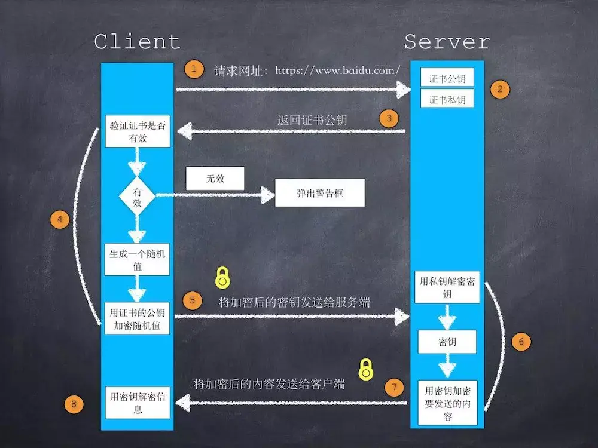

# 参考
- [九个问题从入门到熟悉HTTPS](https://juejin.cn/post/6844903521272201223)
- [谈谈 HTTPS](https://juejin.cn/post/6844903504046211079)

# 阅读后理解的：
* https比http多的一个s，是指的加密（secure）
* 对客户端和服务器之间通信进行加密
  * 防止第三方拿到真实数据
  * 防止第三方篡改
* https使用的是非对称密钥+对称密钥
  * 
* 验证证书是否有效的过程
  * 
* 什么是非对称加密
  * > 给你一把打开的锁，用它锁住重要的东西寄回给我。钥匙我自己留着谁也不给。
  * > 锁=公钥；钥匙=私钥
  * > [解释来自知乎](https://www.zhihu.com/question/33645891)
